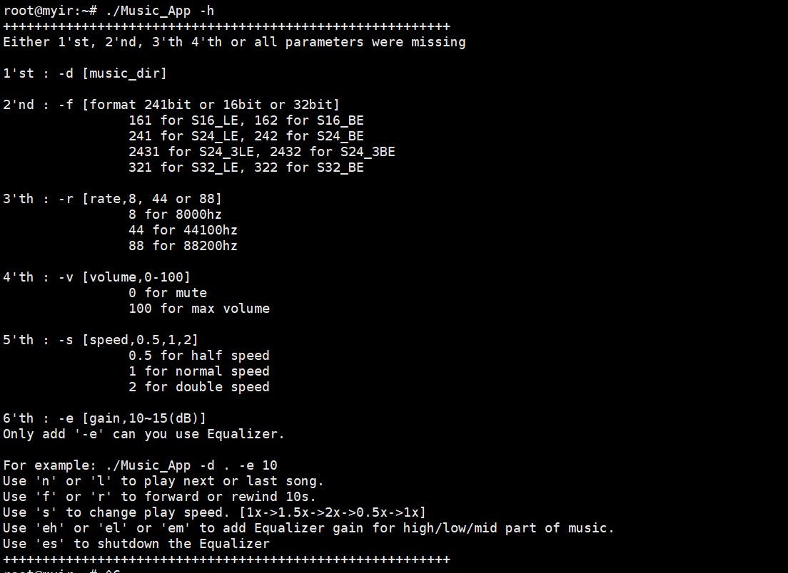

# ALSA-Music-Player

## Introduction

### Background of the project

The platform used in this project is ARM Cortex-A7. We need to write the source code in the Linux operating system and compile it with a cross-compilation chain, and then run it on the ARM Cortex-A7 platform. The audio player based on ALSA implemented in the previous two experiments On top of that, more new functions are implemented for the music player: adjust the previous and next song, play at double speed, fast forward and rewind, support mp3 format files, and implement an audio equalizer using FIR filters.

### Function

- Can play audio files in wav format and mp3 format
- Accept keyboard commands during the running of the program, and can perform the following operations through the command line:
   - Adjust previous and next song
   - Multiple speed playback (including 0.5, 1, 1.5, 2 speed), without distorting the tone and changing the pitch
   - Fast forward 10s and rewind 10s
   - Turn on the audio equalizer (including bass gain, treble gain, midrange gain), and turn off the audio equalizer
- Ability to turn on the audio equalizer implemented using FIR filters to make music sound different (such as louder bass or louder treble)

## Deployment

### Environment configuration

+ slave (operating environment)

   + Development Board Dual Core Arm Cortex-A7

   + OS: Linux

   + Memory and storage: 1GB DDR, 708KB SRAM, 384KB

     AHBSRAM + 64KB AHBSRAM

   + 1 x 4GB eMMC

   + Provide Graphics Processor Unit (GPU): Support OpenGL ES2.0

   + Onboard hardware interface: including IIC, SPI, USB2.0 HOST, USB2.0 OTG, SDIO, CAN, UART, RGB888 signal interface, HDMI interface, RS485 interface, 10/100/1000M Ethernet, SWD standard download interface and Application module extension interface

   + Sensors, actuators, expansion boards, display units, etc.

+ host (development environment)

   + Laptop Linux operating system Ubuntu
     + Use VMware to create a Linux virtual machine in the Windows 11 operating system
     + VMware
       + Model: VMware® Workstation 16 Pro
       + Version: 16.2.4 build-20089737
     + Ubuntu
       + Release version: Ubuntu 18.04.6 LTS
       + LSB version: core-9.20170808ubuntu1-noarch:security-9.20170808ubuntu1-noarch
       + Linux version 5.4.0-107-generic (buildd@lcy02-amd64-070) (gcc version 7.5.0 (Ubuntu 7.5.0-3ubuntu1~18.04)) #121~18.04.1-Ubuntu SMP Thu Mar 24 17: 21:33 UTC 2022
       + CPU: 4 AMD Ryzen 7 6800H with Radeon Graphics
   + Cross compile chain
     + intel x86 -> ARM, provided by TA

+ Master-slave communication

   + Connect the development board and laptop with a USB Type-B cable, the serial port is COM3
   + Use `Xshell` to connect to the development board
     + Version: 7.0.0024
     + Protocol: SERIAL
     + Port: COM3

+ networking

   + Use the mobile hotspot as WiFi, connect the laptop and the development board to the mobile hotspot WiFi
   + Mobile phone hotspot automatically assigns IP addresses to laptops and development boards through DHCP
   + File transfer using `Xftp`
     + `Xftp` version: Version 7
     + Protocol: SFTP
     + Ports: 22

## Experiment procedure

### Steps

1. Configure the environment

    1. Start the Ubuntu virtual machine (development environment) on the laptop
    2. Power on the development board and connect to the laptop via USB-Type-B
    3. Use the phone hotspot as `WiFi` to assign IP addresses to the development board and laptop, and then use `Xftp` to connect

2. Write code in C language in the development environment

3. Use the cross-compilation chain in the development environment to compile the source file into an executable file `Music_App`

    ```bash
    source /opt/st/myir/3.1-snapshot/environment-setup-cortexa7t2hf-neon-vfpv4-ostl-linux-gnueabi
    $CC Music_App.c sonic.c sonic.h Equalizer.c Equalizer.h FirFilter.c FirFilter.h -I . -o Music_App -lasound -pthread -lm
    ```

4. Copy the executable file `Music_App` and wav/mp3 music files generated in the development environment to the development board through XFTP, make sure they are in the same directory

5. Enter the bash of the Linux operating system of the development board through Xshell, grant execution permission to `Music_App`, and then execute and read the wav file information. You can specify the directory location by -d, open the equalizer by `-e` and specify the decibel value to gain.

    ```
    chmod 777 Music_App
    ./Music_App -d . -e 15
    ```

6. Input via keyboard

    "n" or "l" plays the next or last song.
    "f" or "r" forwards or rewinds 10 seconds.
    "s" changes the playback speed. [1 times -> 1.5 times -> 2 times -> 0.5 times -> 1 times]
    "eh" or "el" or "em" add equalizer gain to the high/low/mid parts of the music

    'es' to turn off the equalizer

### Implementation principle and important code

#### Switch to previous song and next song

Scan all the files in the directory specified by the command line to store the music files. If it is a music file that can be played, add it to the music playlist. In order to not block the music playing while monitoring the user's keyboard commands, we put the monitoring of keyboard keys and playing music in two threads.

When the user issues an instruction to switch to the previous or next song, the thread monitoring the keyboard key captures this event and sets the global variable `play_or_not` to false. At this time, the thread playing music reads ` play_or_not` is false, it will actively end its own thread. thereby stopping playback.

```c
if(!play_or_not)
{
     // stop playing
     printf("stop playing\n");
     debug_msg(snd_pcm_drop(pcm_handle), "stop error");
     fclose(fp);
     pthread_exit(NULL);
}
```

Next, read the file name of the previous/next song from the playlist, search for the file in the directory and open it (the method is the same as the second operation), if the file is in mp3 format, convert it to wav format (implementation method See the next section for details), read the wav file header setting parameters (sampling rate, sampling bits, etc.).

Next, set the pcm parameters, and then use the `pthread_create` function to create a new thread to play music. To do this, you need to write the code for playing music as a function. Note that the parameters and return value of this function must be in the format of (void*):

```c
void* play_music(void * e)
```

#### Play music in mp3 format

Based on [`minimp3`](https://github.com/lieff/minimp3), the conversion of mp3 format files is realized. The specific implementation method is as follows:

Function `wavWrite_int16`: used to write the audio data into the wav file in the corresponding wav file format. The function uses `fopen()`, `fwrite()`, `fclose()` and other file-related operation functions, as well as related parameters of the WAV recording file format.

Function `getFileBuffer`: used to read the file buffer, this function returns information such as the location of the file in memory and the size of the file.

Function `DecodeMp3ToBuffer`: Used to decode an MP3 file into a buffer with sample rate, number of channels, and sample data. This function uses the minimp3 open source library to decode MP3 files.

Function `splitpath`: This function splits the path into different parts such as directory, path, filename and filetype, and stores them in different output variables.

We encapsulate a function that converts an mp3 file to a wav file of the same name. This function first reads in the name of the mp3 file to be processed, then calls the `DecodeMp3ToBuffer` function to decode the audio, then calls the `wavWrite_int16` function to write the data into the WAV file, and finally releases the memory and exits the program.

#### double speed playback

Based on a double-speed algorithm invented by Bill Cox, it is specially used for high-quality accelerated vocals. Specifically, it is implemented by [`sonic`](https://github.com/waywardgeek/sonic/blob/master/sonic.h) double-speed library. Specifically, his fundamental frequency modification algorithm uses a 12-point sinc FIR filter for interpolation, which overcomes the disadvantage of damaging the sound quality of the simple interpolation method, and also avoids the disadvantage of changing the pitch caused by changing the sampling rate.

It should be noted that changing the playback speed requires closing the pcm device and re-initializing, but it does not need to close the audio file, so that we can continue reading from the last position, thus realizing **real-time** changing the speed.

#### Fast Forward Fast Rewind

The implementation principle is very simple, it is based on the fseek function to move the pointer position of the currently read file:

```c
// fast forward
int r=fseek(fp,10*wav_header.byte_rate,SEEK_CUR);

// rewind
int now_rate = wav_header.sample_rate;
long nn=-10*((long)wav_header.byte_rate);
int r=fseek(fp,nn,SEEK_CUR);
```

There is a convenient way to calculate the offset of the moving pointer based on the value of `byte_rate` in the header of the wav file, which represents exactly the number of bytes per second, and the second parameter of `fseek` also needs to be Byte is the unit, we want to achieve fast forward/rewind 10 seconds, use 10*`byte_rate`. But it should be noted that this is in the case of normal playback speed. If it is at 0.5 times speed, 2 times speed, etc., it cannot be fast forwarded and rewinded like this.

#### Equalizer

We use the FIR filter to implement the equalizer, the principle of the equalizer and the principle of the FIR filter we refer to [this blog](https://blog.csdn.net/zuguorui/article/details/117448041), the basic idea is as follows :

1. Set the magnitude response of the frequency domain of the FIR filter according to the equalizer. Specifically, the parameter (for example, 10dB) specified by the user is obtained through the command line parameter.
2. Construct the phase response and combine it with the amplitude response to become the frequency domain response of the FIR filter
3. IFFT the frequency domain response of the FIR filter and convolve it with the audio signal.

The effect we have achieved is that we can add different responses to the treble, bass, and midrange.

### Problems and solutions

#### pcm device parameter configuration failed

This is because the pcm device cannot be re-initialized directly when it is turned on, so it must be turned off and then re-opened and initialized.

#### Fallback does not respond

The return value of the fseek function is 0, which does not necessarily mean that it is correct, it may be that it has reached the beginning/end of the file. The reason why the exception reaches the beginning/end of the file when rolling back is because an integer precision overflow occurs. When rolling back, multiply `byte_rate` and `-1` to get a negative number, but note that `byte_rate` is a 32-bit `int`, directly use a 16-bit (that is, short) `int` (-10 ) will cause precision overflow, resulting in abnormal results, so first convert `byte_rate` to `long` and then multiply it with -10.

#### Equalizer stuck

The equalizer will freeze when processing audio, because the processing speed is too slow. After consulting the teaching assistant, I learned that it is because we have set one FIR filter for the three frequency ranges of high/middle/low, and three FIR filters. The filters are connected in parallel, resulting in a large amount of calculation and reducing the processing speed. For this reason, we merged into one filter under the suggestion of the teaching assistant, which increased the speed by three times and solved the problem of stuttering.

#### double speed playback memory leak

When implementing double-speed playback, the amount of data in the array needs to be changed, and our code has a memory leak problem. Special thanks to Wang Ji for his suggestion. He recommended us a memory error detection tool: Address Sanitizer (ASan). The specific usage is to only need to add in the compilation command

```makefile
fsanitize=address
```

You can check out where there may be memory errors.

#### The cross-compilation chain does not support c++

Our original whole project was written in C++. After asking the teaching assistant, we learned that the cross-compilation chain does not support g++, so we rewritten all the C++ codes into C.

#### other

In addition, there are some details. For example, when using the sin function in <math.h>, I kept reporting an error saying that the function definition could not be found. Later, I found out that the reason was that `-lm` was added to the compilation.

## Experimental results

### test set

2 wav audio files, in the `exe` directory, are

+ yujian.wav

   + 16 bit, 44.1khz, 10 seconds

   + Ordinary wav file, used for testing switching previous/next song

+ long.wav
   + 16 bit, 44.1khz, 55 seconds
   + For testing fast forward, fast rewind, double speed playback
+ low.wav
   + 16 bit, 44.1kHz, 1 minute
   + Bass singer singing, used to test our equalizer
+ testmp3one.mp3 and testmp3two.mp3
   + Test the function of decoding mp3


### How to use the program

1. You can specify the directory location by -d, open the equalizer by `-e` and specify the decibel value to gain.

    ```
    ./Music_App -d . -e 15
    ```

2. Input via keyboard

    "n" or "l" plays the next or last song.
    "f" or "r" forwards or rewinds 10 seconds.
    "s" changes the playback speed. [1 times -> 1.5 times -> 2 times -> 0.5 times -> 1 times]
    "eh" or "el" or "em" add equalizer gain to the high/low/mid parts of the music

    'es' to turn off the equalizer (note that the equalizer can only be used at 1x speed)

### Test Results

During the on-site demonstration of the course, the teaching assistant said that there was a video shot on site, so we will not repeat the video recording here.

### Exception handling

If the command line parameter is abnormal, for example, the specified directory does not exist, or there is no audio file in the directory, the prompt information can be output to the console.

If the input command line parameters do not meet the specifications, the help information will be output as follows:



### room for improvement

Further increase the speed of the equalizer.

Provides more options for using the equalizer, such as responding to multiple frequency ranges at the same time.

## Reference

Sonic speed library: https://github.com/waywardgeek/sonic/blob/master/sonic.h

Equalizer: https://github.com/zuguorui/EQ-iir/blob/master/Equalizer.h

FIR filter: https://github.com/mihaibujanca/soundGR/blob/master/FIR-filter-class/filt.h

minimp3: [lieff/minimp3: Minimalistic MP3 decoder single header library (github.com)](https://github.com/lieff/minimp3)